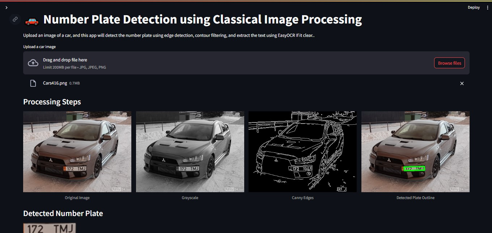

# 🚗 Number Plate Detection - DIP Project
A Streamlit-based project for vehicle number plate detection using Digital Image Processing techniques like grayscale conversion, bilateral filtering, edge detection, and contour approximation with OpenCV. The extracted plate region is then processed with EasyOCR for alphanumeric text recognition.
* A classical image processing project built using OpenCV and Streamlit to automatically detect and read vehicle number plates from images. This solution aims to automate the manual logging process at checkpoints such as university gates and small-scale entry systems.

## ⚙️ How It Works

This project follows a pipeline of classical image processing techniques:

1. **Image Upload**  
   Upload a car image via Streamlit.

2. **Grayscale Conversion**  
   Converts the image to grayscale using `cv2.cvtColor()` for simplified processing.

3. **Bilateral Filtering**  
   Applies `cv2.bilateralFilter()` to reduce noise while preserving edges.

4. **Edge Detection**  
   Detects edges in the image using `cv2.Canny()`.

5. **Contour Detection and Approximation**  
   Finds contours using `cv2.findContours()` and approximates rectangles using `cv2.approxPolyDP()`.

6. **Region Cropping (ROI)**  
   Extracts the detected plate area.

7. **Text Extraction (OCR)**  
   Uses **EasyOCR** to recognize text from the cropped image.

8. **Display Results**  
   Streamlit displays all stages: original image, filtered output, edge detection, plate ROI, and recognized text.

---

## 🧰 Functionalities

- ✅ Upload car images via GUI  
- ✅ Real-time grayscale, edge, and contour previews  
- ✅ Automatic number plate detection  
- ✅ Text recognition using EasyOCR  
- ✅ Interactive Streamlit UI  
- ✅ Optional: Canny edge threshold adjustment  
- ✅ Optional: Download final image with recognized text

---

## 🖼️ Demo

Here’s a screenshot of the system in action:

---

## 🔧 Technologies Used and Project Requirements

- opencv-python for cv2
- streamlit for the web app interface
- numpy for array processing
- pillow (PIL) for image handling (sometimes Streamlit uses this)
- easyocr for OCR text extraction

> pip install -r requirements.txt
---

## Run App
> streamlit run number_plate_code.py

---

## 📊 Results

- Tested on 20 car images with varying lighting and angles.
- ~75% accuracy in correctly detecting and reading clean and clear number plates.
- Common issues: blurry images, skewed angles, or poor lighting.

---

## 🚧 Challenges Faced

- False positives from other rectangular regions (like bumpers or grills).
- OCR errors on low-quality or angled plates.
- Detecting correct contours in noisy or cluttered backgrounds.

---

## 🔮 Future Work

- Add skew/rotation correction for better ROI extraction.
- Extend support to video streams.
- Integrate face recognition and database lookup for person identification.
- Create a complete smart surveillance system for automated entry logging.

---

## 📁 Project Structure

